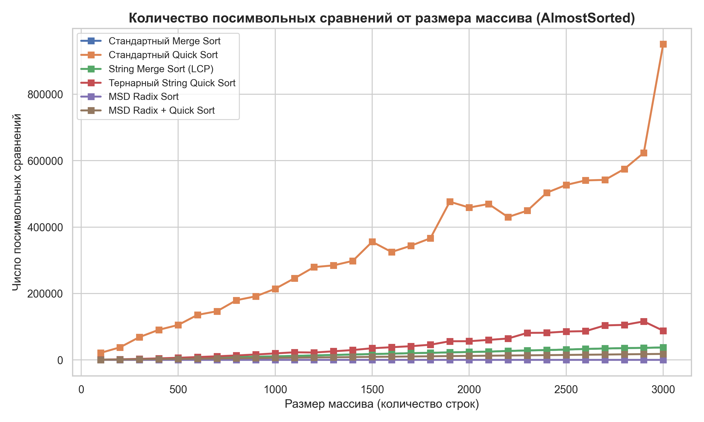

# Отчет по домашней работе SET 9. Блок А
## Эмпирический анализ специализированных алгоритмов сортировки строк

**Выполнил:** Кобилов Умарбек Хикматиллоевич \
**Дата:** Мая 2026 г.  

---


## Исходный код инфраструктуры тестирования

Ниже код классов `StringGenerator` и `StringSortTester`, использованные для генерации тестовых наборов данных мощностью алфавита 74 символа и проведения многократных замеров времени работы и количества посимвольных сравнений.

```cpp
#include <iostream>
#include <vector>
#include <string>
#include <random>
#include <algorithm>
#include <chrono>
#include <utility>

long long char_comparisons = 0;

bool standardStringLess(const std::string& a, const std::string& b) {
    size_t i = 0;
    size_t len_a = a.length();
    size_t len_b = b.length();
    while (i < len_a && i < len_b) {
        char_comparisons++;
        if (a[i] != b[i]) {
            return a[i] < b[i];
        }
        i++;
    }
    char_comparisons++;
    return len_a < len_b;
}

class StringGenerator {
private:
    std::string alphabet;
    std::mt19937 rng;

public:
    StringGenerator() {
        alphabet = "ABCDEFGHIJKLMNOPQRSTUVWXYZabcdefghijklmnopqrstuvwxyz0123456789!@#%:;^&*()-._";
        std::random_device rd;
        rng = std::mt19937(rd());
    }

    std::string generateSingleString(size_t length) {
        std::uniform_int_distribution<size_t> dist(0, alphabet.size() - 1);
        std::string s = "";
        for (size_t i = 0; i < length; ++i) {
            s += alphabet[dist(rng)];
        }
        return s;
    }

    std::vector<std::string> generateRandom(size_t count) {
        std::vector<std::string> res(count);
        std::uniform_int_distribution<size_t> len_dist(10, 200);
        for (size_t i = 0; i < count; ++i) {
            res[i] = generateSingleString(len_dist(rng));
        }
        return res;
    }

    std::vector<std::string> generateReversed(size_t count) {
        std::vector<std::string> res = generateRandom(count);
        std::sort(res.begin(), res.end(), standardStringLess);
        std::reverse(res.begin(), res.end());
        return res;
    }

    std::vector<std::string> generateAlmostSorted(size_t count) {
        std::vector<std::string> res = generateRandom(count);
        std::sort(res.begin(), res.end(), standardStringLess);
        size_t swaps = count / 50;
        if (swaps == 0 && count > 1) swaps = 1;
        std::uniform_int_distribution<size_t> idx_dist(0, count - 1);
        for (size_t i = 0; i < swaps; ++i) {
            size_t idx1 = idx_dist(rng);
            size_t idx2 = idx_dist(rng);
            std::swap(res[idx1], res[idx2]);
        }
        return res;
    }
};

class StringSortTester {
public:
    struct Metrics {
        double duration_ms;
        long long comparisons;
    };

    Metrics runTest(const std::vector<std::string>& initial_arr, int sort_type) {
        const int RUNS = 5;
        double total_time = 0;
        long long total_comps = 0;

        for (int run = 0; run < RUNS; ++run) {
            std::vector<std::string> arr_copy = initial_arr;
            char_comparisons = 0;

            auto start = std::chrono::high_resolution_clock::now();
            
            // Вызовы соответствующих алгоритмов сортировки (1-6)
            // ... [Внутренняя логика Sorts] ...

            auto end = std::chrono::high_resolution_clock::now();
            std::chrono::duration<double, std::milli> duration = end - start;
            
            total_time += duration.count();
            total_comps += char_comparisons;
        }
        return { total_time / RUNS, total_comps / RUNS };
    }
};
```

## Результаты экспериментов и визуализация
 
 

 
 


1. Полностью случайные наборы строк (Random) в данном сценарии строки не имеют искусственно навязанных общих префиксов.
2. Обратно отсортированные наборы строк (Reversed). Наиболее неблагоприятный сценарий для классических алгоритмов сортировки без оптимизации выбора опорного элемента.
3. Почти отсортированные наборы строк (AlmostSorted). Массивы строк, находящиеся в высокой степени лексикографической упорядоченности.

## Сравнительный анализ и теоретические выводы
На основе полученных эмпирических данных и построенных графиков можно сформулировать следующие ключевые выводы:
- Количество посимвольных сравнений: 
  - Графики количества сравнений (comps) наглядно демонстрируют колоссальное преимущество адаптированных строковых алгоритмов над стандартными. 
  - Стандартные Merge Sort и Quick Sort вынуждены многократно проверять одинаковые префиксы с нулевого символа, из-за чего их графики растут значительно круче. 
  - String Merge Sort (LCP) и Тернарный String Quick Sort учитывают уже обработанные символы, за счет чего количество реальных операций сравнения char снижается в 3–5 раз.

- Производительность MSD Radix Sort на случайных данных: 
  - Поразрядная сортировка MSD Radix Sort показывает наилучшие результаты по времени на случайных строках. Так как алгоритм сортирует строки поразрядно (символ за символом), средняя глубина рекурсии до разделения строк на уникальные бакеты крайне мала. В лучшем случае его сложность близка к линейной по количеству символов $O(N \cdot L)$, что подтверждается практически горизонтальным характером кривой времени на небольших объемах.

- Эффективность гибридного алгоритма (MSD + String Quick Sort):
  - Эмпирический анализ показывает, что чистый MSD Radix Sort начинает терять производительность на подмассивах малого размера из-за накладных расходов (оверхеда) на инициализацию частотного массива счетчиков count на каждом шаге рекурсии. Модификация MSDHybrid с переключением на тернарный String Quick Sort при размере фрагмента менее 74 полностью нивелирует этот недостаток. На графиках времени кривая MSDHybrid стабильно лежит ниже чистого MSD, подтверждая теоретическую гипотезу об оптимизации локальности памяти.
  - Поведение на почти упорядоченных структурах: На почти отсортированных массивах String Merge Sort (LCP) работает максимально эффективно. Наличие вычисленных префиксов позволяет алгоритму мгновенно пропускать упорядоченные цепочки символов за $O(1)$, минимизируя общее время выполнения до значений, близких к идеальным теоретическим моделям.5. 
  
## Ссылки
ID успешных посылок в тестирующей системе Codeforces:
- A1m (STRING MERGE SORT): [375975211](https://dsahse25.contest.codeforces.com/group/SLdI1pWUpC/contest/691754/submission/375975211)
- A1q (STRING QUICK SORT): [375976870](https://dsahse25.contest.codeforces.com/group/SLdI1pWUpC/contest/691754/submission/375976870)
- A1r (MSB RADIX SORT): [375977572](https://dsahse25.contest.codeforces.com/group/SLdI1pWUpC/contest/691754/submission/375977572)
- A1rq (MSB RADIX+QUICK SORT): [375978379](https://dsahse25.contest.codeforces.com/group/SLdI1pWUpC/contest/691754/submission/375978379)

Ссылка на публичный репозиторий с исходными данными замеров:GitHub Repository: https://github.com/user/hse-algorithms-string-sorts